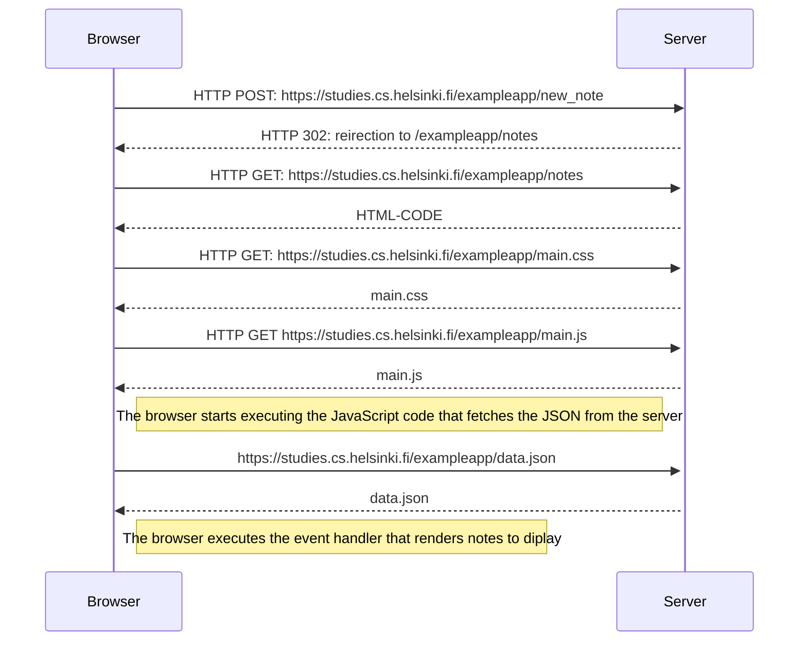

#0.4: Nuevo diagrama de nota
<H1>0.4: Nuevo diagrama de nota</H1>

Describe la situación en la que el usuario crea una nueva nota en la página https://studies.cs.helsinki.fi/exampleapp/notes escribiendo algo en el campo de texto y haciendo clic en el botón Save

