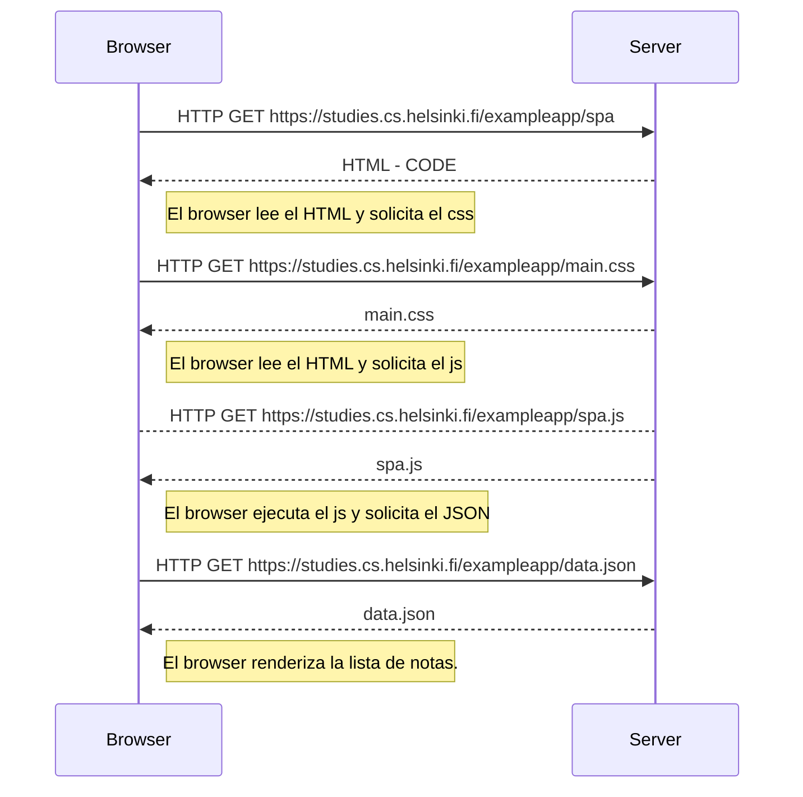

#0.5:  Diagrama de aplicación de una sola página
<H1>0.5: Diagrama de aplicación de una sola página</H1>

Describe la situación en la que el usuario ingresa a la aplicación de una sola página en https://fullstackopen.com/es/part0/fundamentos_de_las_aplicaciones_web#aplicacion-de-una-sola-pagina. 

